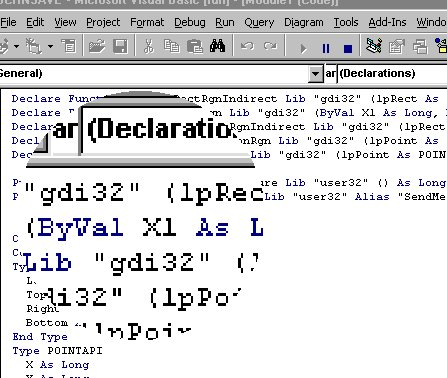



## Zoom

### Description

A multitude of API calls including: CreateEllipticRgnIndirect, CreateRectRgn, CreateEllipticRgn, SetWindowRgn, StretchBlt, etc... Results in a scrollable 'zooming' window.
 
### More Info
 
Press [Esc] at anytime to bring up an option window.

             |
---                |---
**Submitted On**   |2000-06-07 11:45:58
**By**             |[Dave Smith](https://github.com/Planet-Source-Code/PSCIndex/blob/master/ByAuthor/dave-smith.md)
**Level**          |Advanced
**User Rating**    |4.3 (13 globes from 3 users)
**Compatibility**  |VB 5\.0, VB 6\.0
**Category**       |[Windows API Call/ Explanation](https://github.com/Planet-Source-Code/PSCIndex/blob/master/ByCategory/windows-api-call-explanation__1-39.md)
**World**          |[Visual Basic](https://github.com/Planet-Source-Code/PSCIndex/blob/master/ByWorld/visual-basic.md)
**Archive File**   |[CODE\_UPLOAD6515672000\.zip](https://github.com/Planet-Source-Code/dave-smith-zoom__1-8709/archive/master.zip)

